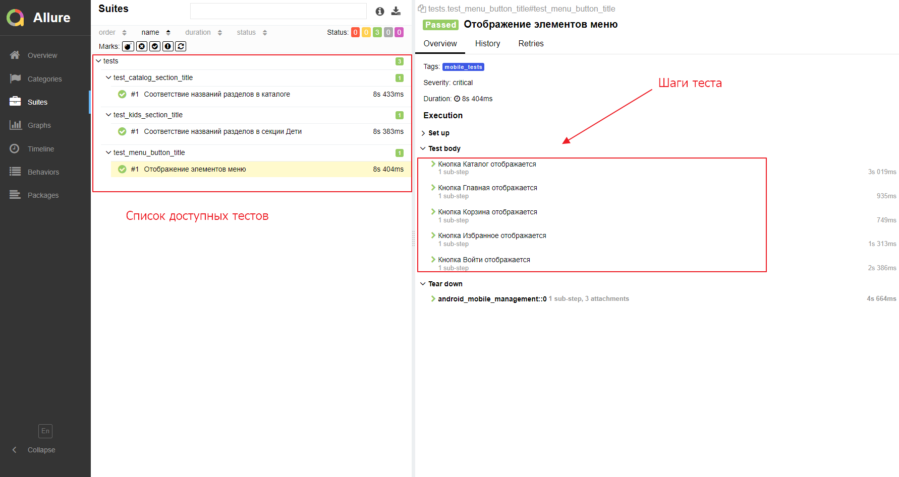
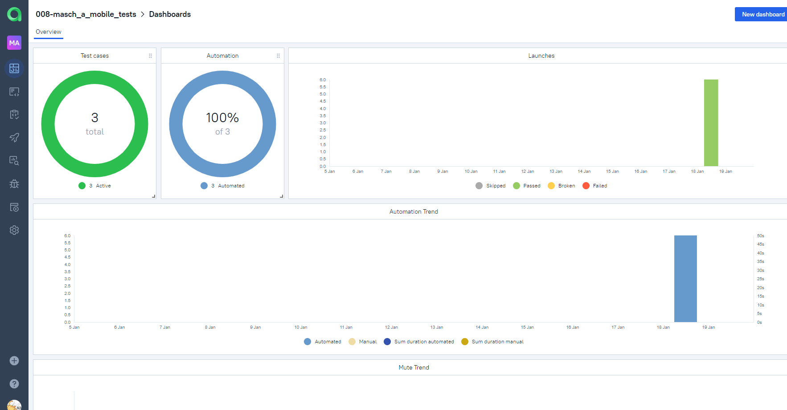
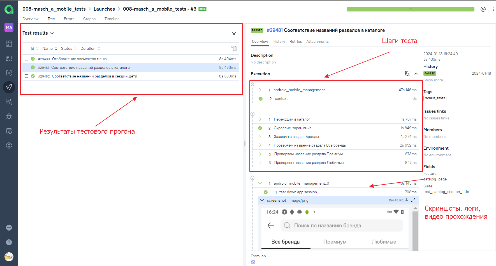
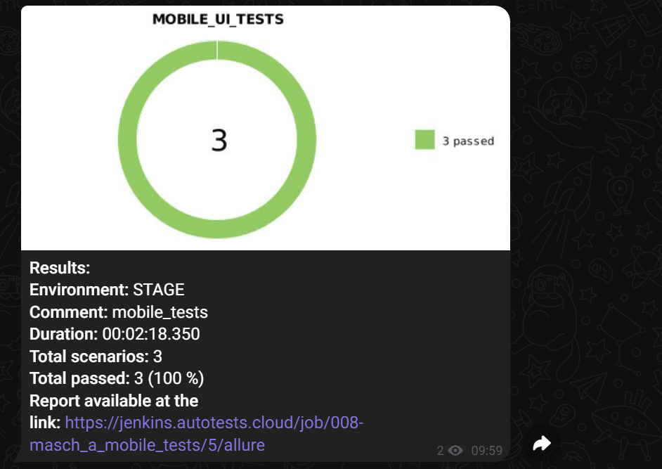
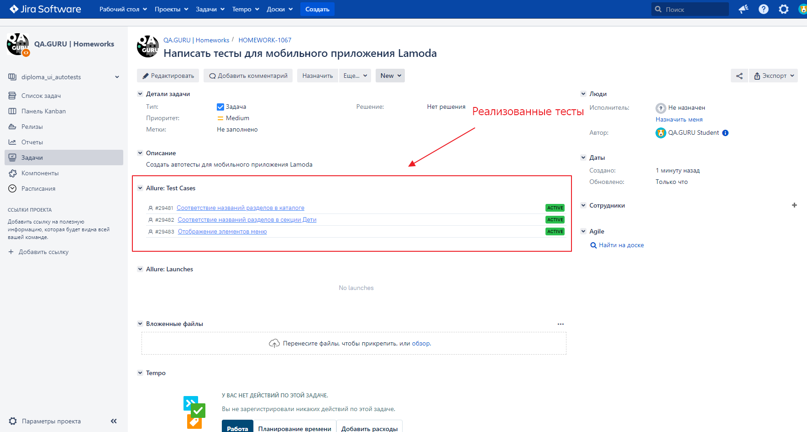

# Автоматизация тестирования мобильного приложения Lamoda

## Особенности проекта
* Оповещения о тестовых прогонах в Telegram
* Отчеты с видео, скриншотом, логами
* Сборка проекта в Jenkins
* Отчеты Allure Report
* Интеграция с Allure TestOps
* Интеграция с Jira

## Список, реализованных проверок
* Отображение элементов меню
* Соответствие названий разделов в каталоге
* Соответствие названий разделов в детском разделе

## Запуск тестов из Jenkins
### Ссылка на проект в Jenkins
> <a target="_blank" href="https://jenkins.autotests.cloud/job/008-masch_a_mobile_tests/">Jenkins</a>
> 
1. Перейти в Jenkins
2. Нажать Build with Parameters
3. Нажать Build
## Allure Report

## Интеграция с Allure TestOps
### Дашборд с информацией о тестовом проекте

## Отчет о пройденных тестах в Telegram
В проекте настроена отправка отчета о прохождении тестов в Telegram

## Интеграция с Jira
<a target="_blank" href="https://jira.autotests.cloud/browse/HOMEWORK-1067">Ссылка на проект в Jira</a>

## Видео прохождения теста

